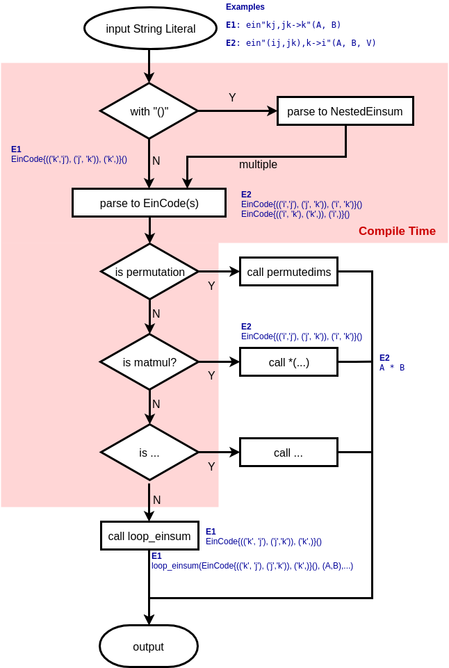

# OMEinsum.jl

This package exports one function, `einsum`, with three interfaces.
`einsum` implements functionality similar to the `einsum` function in `numpy`,
although some details are different.

`einsum` operations are specified by a tuple of tensors `xs = (x1, x2, x3...)`
, a tuple of index-labels for the tensors in `xs`, `ixs = (ix1, ix2, ix3...)`,
and output index-labels `iy` specified as `einsum(EinCode(ixs,iy), xs)`.
Alternatively, operations can be specified using the `@ein`-macro or
the `@ein_str`- string literal (see examples or help).

Let `l` be the set of all unique labels in the `ixs` without the ones in `iy`.
`einsum` then calculates an output tensor `y` with indices labelled `iy` according
to the following specification:
```math
\forall iy : y[iy] = \sum_l x_1[ix_1] * x_2[ix_2] * x_3[ix_3] \ldots
```

where the sum over `l` implies the sum over all possible values of the labels in `l`.

As an example, consider the _matrix multiplication_ of two random 2×2 tensors, where we have:
```julia
xs = (rand(2,2), rand(2,2))
ixs = (('i','j'),('j','k'))
iy = ('i','k')
```
Now `l = ('j',)` since all unique indices are `('i','j','k')`
but both `'i'` and `'k'` are in `iy`.
The output `y` is then defined by
```math
\forall i,k : y[i,k] = \sum_j x_1[i,j] * x_2[j,k]
```
which is just the regular definition of matrix multiplication. Alternatively it could've been specified with a custom string-literal as `ein"ij,jk -> ik"(rand(2,2),rand(2,2))`, see [Input (flat)](@ref).

The structure of an `einsum` evaluation with the string-literal is depicted
in the flowchart below:

